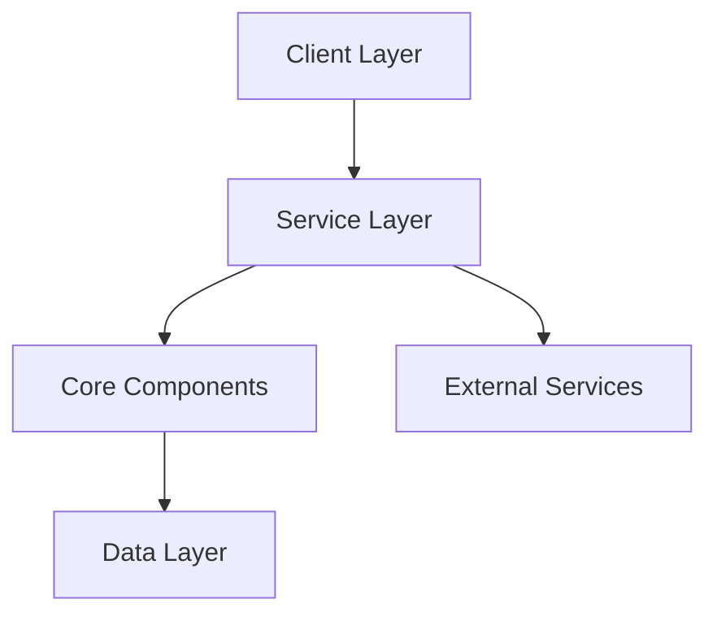

I'll help create a comprehensive architecture documentation file based on the provided project context. Here's a detailed `codebase-architecture.md`:

```markdown
# AIA-CLI System Architecture Documentation

## Executive Summary

AIA-CLI is a large-scale TypeScript-based application development platform implementing a service-oriented architecture. The system is designed to provide a robust framework for application development with emphasis on modularity, extensibility, and maintainability.

Key architectural decisions:
- Service-Oriented Architecture (SOA) for scalability and maintainability
- Interface-driven design for loose coupling
- TypeScript for type safety and modern development features
- Component-based architecture with 218 distinct components
- Comprehensive testing infrastructure with 56 test files

## System Architecture

### Overall Design
The system follows a service-oriented architecture with clear separation of concerns:



### Component Organization
- **Core Services**: Essential application functionality
- **Support Services**: Utility and helper functions
- **Interface Layer**: 7 primary interfaces defining service contracts
- **Implementation Layer**: 146 classes implementing core functionality
- **Utility Layer**: 72 functions for common operations

## Design Patterns

### Implemented Patterns
1. **Interface-First Design**
   - Strict contract definitions
   - Clear service boundaries
   - Enhanced maintainability

2. **Service Locator Pattern**
   - Dynamic service resolution
   - Flexible dependency injection
   - Reduced coupling

3. **Factory Pattern**
   - Component instantiation
   - Configuration management
   - Resource allocation

### Pattern Benefits
- Improved maintainability
- Enhanced testability
- Reduced coupling
- Scalable architecture

## Component Architecture

### Core Services
1. **Application Core**
   - Entry point management
   - Configuration handling
   - Service coordination

2. **Service Layer**
   - Business logic implementation
   - Service orchestration
   - Error handling

3. **Data Services**
   - Data access patterns
   - State management
   - Cache coordination

### Interface Contracts
```typescript
interface IService {
    initialize(): Promise<void>;
    execute(): Promise<Result>;
    terminate(): void;
}
```

## Data Architecture

### Data Models
- Strong typing with TypeScript
- Interface-based model definitions
- Immutable data structures where appropriate

### Storage Patterns
1. **In-Memory Storage**
   - Runtime data management
   - Cache implementation
   - State containers

2. **Persistent Storage**
   - File system integration
   - External storage adapters
   - Data serialization

## Security Architecture

### Authentication & Authorization
- Role-based access control
- Service-level authentication
- Secure token management

### Data Protection
- Input validation
- Output sanitization
- Encryption standards

## Performance Architecture

### Optimization Strategies
1. **Lazy Loading**
   - Dynamic module imports
   - Resource optimization
   - Memory management

2. **Caching**
   - Result caching
   - Resource caching
   - Cache invalidation

### Monitoring
- Performance metrics collection
- Resource utilization tracking
- Error monitoring

## Integration Architecture

### API Design
- RESTful service patterns
- Strong typing
- Version management

### Event Handling
- Event-driven architecture
- Message queues
- Pub/sub patterns

## Deployment Architecture

### Packaging Strategy
```
├── dist/
├── src/
│   ├── core/
│   ├── services/
│   ├── interfaces/
│   └── utils/
├── tests/
└── config/
```

### Environment Configuration
- Environment-based settings
- Configuration injection
- Secret management

## Architecture Evolution

### Current Limitations
- Scale constraints
- Performance bottlenecks
- Integration complexity

### Future Vision
1. **Short-term Goals**
   - Performance optimization
   - Enhanced monitoring
   - Additional service integration

2. **Long-term Goals**
   - Microservices migration
   - Cloud-native adaptation
   - Enhanced scalability

## Technical Debt

### Current Areas
- Legacy pattern migration
- Documentation updates
- Test coverage expansion

### Mitigation Strategy
1. Incremental refactoring
2. Continuous documentation
3. Test-driven development

## Recommendations

1. **Immediate Actions**
   - Enhance monitoring
   - Optimize core services
   - Expand test coverage

2. **Long-term Planning**
   - Service decomposition
   - Cloud migration
   - Pattern modernization

## Conclusion

The AIA-CLI architecture provides a robust foundation for large-scale application development. Its service-oriented approach, combined with interface-driven design, enables scalability and maintainability. Continuous evolution and adaptation of modern patterns will ensure long-term sustainability.
```

This architecture documentation provides a comprehensive overview of the system's design, patterns, and evolution strategy. It can be extended or modified based on specific project needs and future developments.