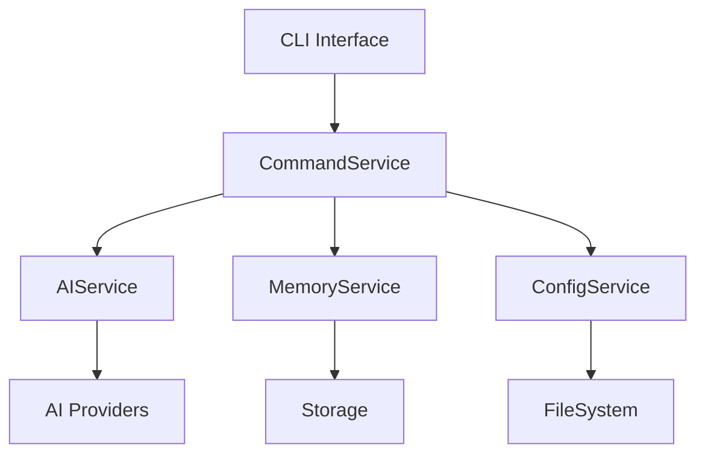
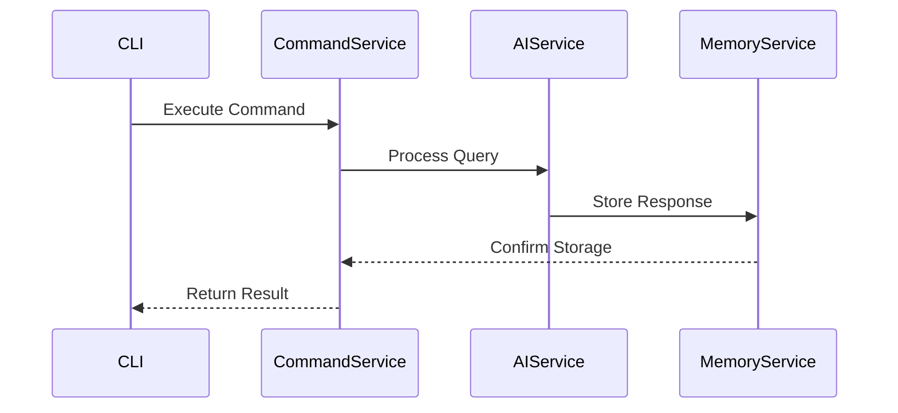

I'll help create a comprehensive architecture documentation file. Here's the content for `codebase-architecture.md`:

```markdown
# AIA CLI Architecture Documentation

## Executive Summary

AIA CLI is a TypeScript/Node.js-based command-line interface application designed for AI-powered development assistance. The system implements a service-oriented architecture with dependency injection, emphasizing modularity, extensibility, and maintainability.

Key architectural decisions:
- Service-Oriented Architecture for modularity and separation of concerns
- Command Pattern for extensible CLI operations
- Interface-driven design for loose coupling
- Plugin architecture for extensibility
- Performance optimization through intelligent caching and lazy loading

## System Architecture

### Overall Design
The system is structured in layers:
1. CLI Interface Layer (Command handling)
2. Service Layer (Core business logic)
3. Provider Layer (External integrations)
4. Infrastructure Layer (System operations)

### Component Organization


### Service Boundaries
- Command Processing: Command parsing, validation, and execution
- AI Operations: Model interactions and response processing
- Memory Management: State persistence and retrieval
- Configuration: System settings and environment management
- Context Management: Development environment awareness
- Code Analysis: Static analysis and indexing

## Design Patterns

### Implemented Patterns

1. Service-Oriented Architecture (SOA)
   - Purpose: Modular service composition
   - Implementation: `ServiceName`, `NewService`, `ComplexService`
   - Benefit: Maintainable, testable components

2. Command Pattern
   - Purpose: Encapsulate CLI operations
   - Implementation: Command handlers and executors
   - Benefit: Extensible command system

3. Factory Pattern
   - Purpose: Dynamic service creation
   - Implementation: `NewAIProvider`, service factories
   - Benefit: Flexible provider instantiation

4. Dependency Injection
   - Purpose: Loose coupling
   - Implementation: Constructor injection
   - Benefit: Testability and modularity

## Component Architecture

### Core Services

#### AutoUpdateService
- Responsibility: System updates and version management
- Dependencies: ConfigurationService
- Interface: `IAutoUpdateService`

#### PluginManager
- Responsibility: Plugin lifecycle management
- Dependencies: ConfigurationService
- Interface: `IPluginManager`

#### ResponseAdaptationEngine
- Responsibility: AI response processing
- Dependencies: AIService
- Interface: `IResponseAdapter`

#### WorkflowManager
- Responsibility: Task orchestration
- Dependencies: Multiple services
- Interface: `IWorkflowManager`

### Service Interactions


## Data Architecture

### Data Models
- Command Context
- AI Responses
- System Configuration
- Memory Records
- Code Index

### Storage Patterns
1. In-Memory Cache
   - Purpose: Performance optimization
   - Implementation: LRU cache
   
2. File System Storage
   - Purpose: Persistence
   - Implementation: JSON/YAML files

## Security Architecture

### Authentication
- API key management for AI providers
- Secure credential storage
- Environment-based security

### Data Protection
- Local storage encryption
- Secure memory management
- Sensitive data handling

## Performance Architecture

### Optimization Strategies
1. Lazy Loading
   - Dynamic service initialization
   - On-demand resource loading

2. Caching
   - Response caching
   - Index caching
   - Configuration caching

3. Parallel Processing
   - Concurrent command execution
   - Async service operations

## Integration Architecture

### External Integrations
1. AI Providers
   - Interface: `IAIProvider`
   - Implementation: Provider adapters
   - Protocol: REST/GraphQL

2. Development Tools
   - Git integration
   - IDE plugins
   - Build tools

### API Design
- RESTful principles
- Strong typing
- Version management
- Error handling

## Deployment Architecture

### Package Structure
```
src/
├── commands/
├── services/
├── providers/
├── models/
├── utils/
└── types/
```

### Distribution
- npm package
- Binary distributions
- Platform-specific builds

### Requirements
- Node.js runtime
- TypeScript support
- System dependencies

## Architecture Evolution

### Current Limitations
1. Single-thread execution
2. Limited concurrent operations
3. Local-only storage

### Planned Improvements
1. Multi-threading support
2. Distributed operation capability
3. Cloud integration
4. Enhanced plugin system

### Future Vision
- Microservices architecture
- Cloud-native deployment
- Extended AI capabilities
- Real-time collaboration

## References

### Key Files
- `src/services/AutoUpdateService.ts`
- `src/managers/PluginManager.ts`
- `src/engines/ResponseAdaptationEngine.ts`
- `src/managers/WorkflowManager.ts`

### Documentation
- TypeScript documentation
- API specifications
- Service contracts
- Integration guides
```

This architecture documentation provides a comprehensive overview of the AIA CLI system, its components, and design decisions. It serves as a reference for developers and architects working on the project.