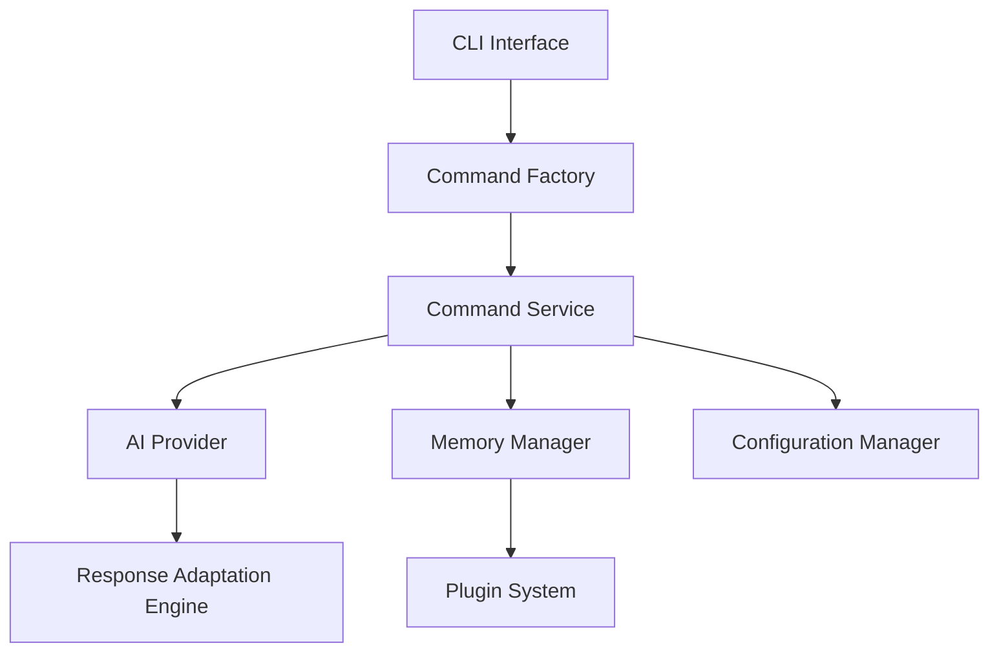

I'll help create a comprehensive architecture documentation file. Here's the content for `codebase-architecture.md`:

```markdown
# AIA CLI Architecture Documentation

## Executive Summary

The AIA CLI is a sophisticated TypeScript/Node.js command-line application designed to provide AI-powered development assistance. The system implements a service-oriented architecture with strong emphasis on dependency injection, modularity, and extensibility.

Key architectural characteristics:
- Service-oriented design with clear component boundaries
- Command pattern implementation for operation handling
- Factory pattern usage for object creation
- Robust memory management and context awareness
- Plugin-based extensibility
- Performance-optimized request handling

## System Architecture

### Overall Design
The system is structured in layers:

1. **Presentation Layer**
   - CLI interface
   - Command parsing
   - User interaction

2. **Application Layer**
   - Command processing
   - Workflow management
   - Service orchestration

3. **Domain Layer**
   - Core business logic
   - AI interactions
   - Memory management

4. **Infrastructure Layer**
   - Configuration management
   - Plugin system
   - External integrations

### Component Organization



## Design Patterns

### Implemented Patterns

1. **Service-Oriented Architecture (SOA)**
   - Loose coupling between components
   - Clear service boundaries
   - Interface-based communication

2. **Command Pattern**
   ```typescript
   interface ICommand {
     execute(): Promise<void>;
     validate(): boolean;
   }
   ```

3. **Factory Pattern**
   ```typescript
   class CommandFactoryV2 {
     createCommand(type: string): ICommand;
   }
   ```

4. **Dependency Injection**
   ```typescript
   class AIService {
     constructor(
       private provider: IAIProvider,
       private memory: IMemoryManager
     ) {}
   }
   ```

## Component Architecture

### Core Services

1. **ConfigurationManager**
   - Configuration loading
   - Environment management
   - Settings validation

2. **MemoryManager**
   - Conversation history
   - Context persistence
   - State management

3. **PluginManager**
   - Plugin discovery
   - Extension loading
   - Feature management

4. **ResponseAdaptationEngine**
   - Response formatting
   - Output customization
   - Template processing

### Service Responsibilities

| Service | Primary Responsibility | Dependencies |
|---------|----------------------|--------------|
| AIProviderFactory | AI provider instantiation | ConfigurationManager |
| CommandValidationService | Command validation | ContextInfo |
| WorkflowManager | Process orchestration | MemoryManager, AIService |

## Data Architecture

### Data Models

```typescript
interface ContextInfo {
  workingDirectory: string;
  projectType: string;
  gitStatus: string;
}

interface MemoryEntry {
  timestamp: number;
  type: string;
  content: any;
}
```

### Storage Patterns
- In-memory storage for active sessions
- File-based persistence for configuration
- Cached results for performance optimization

## Security Architecture

### Authentication
- API key management for AI services
- Secure configuration storage
- Environment-based security controls

### Data Protection
- Local storage encryption
- Sensitive data masking
- Secure memory management

## Performance Architecture

### Optimization Strategies
1. **Request Optimization**
   - Response caching
   - Batch processing
   - Lazy loading

2. **Memory Management**
   - Efficient data structures
   - Resource pooling
   - Garbage collection optimization

### Monitoring
- Performance metrics collection
- Response time tracking
- Resource usage monitoring

## Integration Architecture

### External Integrations
1. **AI Providers**
   - OpenAI
   - Azure AI
   - Custom providers

2. **Development Tools**
   - Git integration
   - IDE plugins
   - Build tools

### API Design
```typescript
interface IAIProvider {
  query(prompt: string, context: ContextInfo): Promise<Response>;
  stream(prompt: string, context: ContextInfo): AsyncIterator<Response>;
}
```

## Deployment Architecture

### Distribution
- NPM package
- Docker container
- Standalone executable

### Requirements
- Node.js runtime
- Configuration file
- API credentials

## Architecture Evolution

### Current Limitations
1. Single-threaded execution model
2. Limited concurrent processing
3. Memory constraints for large datasets

### Planned Improvements
1. Worker thread implementation
2. Distributed processing support
3. Enhanced caching mechanisms
4. Improved plugin architecture

### Future Vision
- Microservices architecture
- Cloud-native deployment
- Real-time collaboration
- Extended AI capabilities

## Best Practices

### Code Organization
- Feature-based folder structure
- Clear separation of concerns
- Interface-driven development
- Comprehensive documentation

### Development Guidelines
1. Use dependency injection
2. Follow SOLID principles
3. Write unit tests
4. Document public APIs
5. Implement error handling

## Conclusion

The AIA CLI architecture provides a robust foundation for AI-powered development assistance. Its service-oriented design, coupled with strong patterns and practices, ensures maintainability, extensibility, and performance.

---

Last Updated: [Current Date]
Version: 1.0
```

This architecture documentation provides a comprehensive overview of the system's design, patterns, and components. It serves as a reference for developers and architects working on the project, ensuring consistent implementation and future scalability.