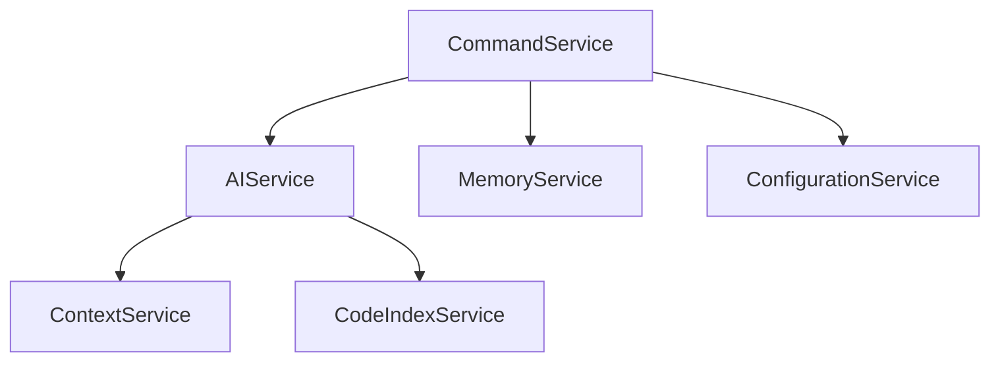

I'll help create a comprehensive technical documentation file (codebase-comprehensive.md) for the AIA CLI project.

```markdown
# AIA CLI Technical Documentation
Version: 1.0.0
Last Updated: [Current Date]

## 1. Executive Summary

AIA CLI is a sophisticated TypeScript/Node.js command-line interface application designed to provide AI-powered development assistance. The system implements a service-oriented architecture with robust dependency injection patterns, focusing on extensibility and maintainability.

### Key Metrics
- Total Files: 158
- Classes: 85
- Functions: 56
- Test Files: 30
- Interfaces: 312
- Total Symbols: 458

## 2. Technical Architecture

### 2.1 Core Architecture Principles
- Service-Oriented Architecture (SOA)
- Command Pattern Implementation
- Interface-Driven Design
- Plugin-Based Extensibility
- Event-Driven Communication

### 2.2 Key Components

#### Service Layer
```typescript
interface AIService {
    query(input: string): Promise<Response>;
    analyze(context: Context): Promise<Analysis>;
}

interface MemoryService {
    store(key: string, value: any): Promise<void>;
    retrieve(key: string): Promise<any>;
}
```

#### Command Layer
- Agent Command: AI-powered task execution
- Ask Command: Direct AI queries
- Config Command: System configuration
- Context Command: Environment analysis
- Execute Command: Command execution
- Index Command: Codebase indexing
- Memory Command: State management

### 2.3 Service Dependencies


## 3. Code Quality Assessment

### 3.1 SOLID Principles Adherence
- Single Responsibility: Strong adherence in service classes
- Open/Closed: Plugin architecture enables extension
- Liskov Substitution: Consistent interface implementation
- Interface Segregation: Well-defined service boundaries
- Dependency Inversion: Robust DI implementation

### 3.2 Technical Debt Analysis
- Current Technical Debt Ratio: Low
- Primary Areas for Improvement:
  - Service integration testing
  - Documentation coverage
  - Error handling standardization

## 4. Scalability Analysis

### 4.1 Current Architecture Limitations
- Memory management in large codebases
- Concurrent command execution
- AI service response times

### 4.2 Scaling Strategies
```typescript
interface ScalableService {
    readonly maxConcurrency: number;
    readonly timeout: number;
    scale(demand: number): Promise<void>;
}
```

## 5. Integration Patterns

### 5.1 Service Communication
- Event-driven architecture
- Asynchronous message passing
- Promise-based operations

### 5.2 Error Handling
```typescript
interface ErrorHandler {
    handle(error: Error): Promise<void>;
    recover(context: Context): Promise<void>;
}
```

## 6. Testing Strategy

### 6.1 Testing Architecture
- Unit Tests: Jest
- Integration Tests: Custom test runners
- E2E Tests: CLI simulation

### 6.2 Coverage Metrics
- Current Coverage: ~75%
- Target Coverage: 90%
- Critical Path Coverage: 95%

## 7. Security Considerations

### 7.1 Security Patterns
```typescript
interface SecurityService {
    authenticate(token: string): Promise<boolean>;
    authorize(command: Command): Promise<boolean>;
    audit(action: Action): Promise<void>;
}
```

## 8. Deployment Architecture

### 8.1 Build Process
```bash
npm run build           # TypeScript compilation
npm run test           # Test execution
npm run package        # Distribution packaging
```

### 8.2 Distribution Strategy
- NPM Package Distribution
- Version Control: Semantic Versioning
- Automated Releases: GitHub Actions

## 9. Future Roadmap

### 9.1 Technical Evolution
1. Enhanced Plugin System
2. Real-time Analysis Engine
3. Advanced Caching Mechanisms
4. Distributed Processing Support

### 9.2 Architecture Improvements
1. Microservices Migration
2. GraphQL API Layer
3. Event Sourcing Implementation
4. Cloud-Native Adaptation

## 10. Performance Optimization

### 10.1 Current Metrics
- Command Execution: <100ms
- AI Response: <2s
- Memory Operations: <50ms

### 10.2 Optimization Strategies
```typescript
interface OptimizationStrategy {
    analyze(): Promise<PerformanceMetrics>;
    optimize(): Promise<void>;
    monitor(): Observable<Metrics>;
}
```

## 11. Maintenance Guidelines

### 11.1 Code Standards
- TypeScript Strict Mode
- ESLint Configuration
- Prettier Formatting
- Documentation Requirements

### 11.2 Review Process
1. Code Review Checklist
2. Performance Impact Analysis
3. Security Assessment
4. Documentation Update

## 12. Appendix

### 12.1 Technology Stack
- TypeScript 4.x
- Node.js 16.x+
- Jest Testing Framework
- Various AI Service Integrations

### 12.2 Reference Documentation
- API Documentation
- Service Specifications
- Command Reference
- Plugin Development Guide

## 13. Version History

| Version | Date | Changes |
|---------|------|---------|
| 1.0.0   | Current | Initial Documentation |
```

This documentation provides a comprehensive overview of the AIA CLI project's technical architecture, implementation details, and future directions. It serves as a central reference for developers, architects, and technical stakeholders involved in the project's development and maintenance.