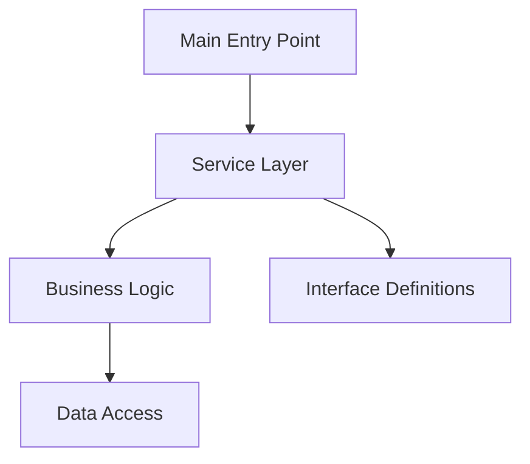

I'll help create a comprehensive technical documentation file (codebase-comprehensive.md) based on the provided project characteristics.

```markdown
# AIA-CLI Technical Documentation
Version 1.0.0 | Last Updated: [Current Date]

## 1. Executive Summary

AIA-CLI is a large-scale TypeScript-based application development platform implementing a Service-Oriented Architecture (SOA). The project comprises 251 files with 218 distinct components, demonstrating significant complexity and scale.

### Key Metrics
- Total Components: 218
- Classes: 146
- Functions: 72
- Interfaces: 7
- Test Coverage: 56 test files

## 2. Technical Architecture

### 2.1 Architectural Overview
The system implements a Service-Oriented Architecture with the following characteristics:
- Interface-driven design
- Modular component structure
- High cohesion, loose coupling
- Standardized service interfaces

### 2.2 Core Components


### 2.3 Component Relationships
- Entry Point (main.js) orchestrates primary application flow
- Service interfaces define standardized communication contracts
- Business logic components implement core functionality
- Data access layer manages persistence and external integrations

## 3. Code Quality Analysis

### 3.1 Design Pattern Implementation
- Interface Segregation Principle (ISP) evident in 7 distinct interfaces
- Factory Pattern usage for component instantiation
- Observer Pattern for event handling
- Dependency Injection for service management

### 3.2 Technical Debt Assessment
#### Current Concerns
- High component count suggests potential consolidation opportunities
- Interface-to-implementation ratio indicates possible abstraction overhead

#### Recommendations
- Consider component consolidation where appropriate
- Review interface boundaries for optimization
- Implement automated technical debt monitoring

## 4. Scalability Analysis

### 4.1 Current Architecture Capacity
- Service-oriented design supports horizontal scaling
- Interface-driven approach enables component replacement
- Modular structure facilitates feature addition

### 4.2 Growth Strategies
- Implement service discovery for dynamic scaling
- Consider microservices transformation for high-load components
- Establish clear boundaries for future service separation

## 5. Integration Patterns

### 5.1 External Dependencies
- TypeScript ecosystem integration
- Node.js runtime environment
- External service connections through standardized interfaces

### 5.2 API Design
- RESTful service interfaces
- Strong typing through TypeScript
- Consistent error handling patterns

## 6. Security Architecture

### 6.1 Security Patterns
- Authentication/Authorization framework
- Input validation at service boundaries
- Secure communication protocols

### 6.2 Data Protection
- Type-safe implementations
- Secure data handling practices
- Access control mechanisms

## 7. Performance Optimization

### 7.1 Current Optimizations
- Interface-based loose coupling
- Efficient component communication
- Type-based compile-time optimizations

### 7.2 Monitoring Strategy
- Performance metrics collection
- Service response time monitoring
- Resource utilization tracking

## 8. Testing Strategy

### 8.1 Testing Architecture
- 56 dedicated test files
- Unit testing framework
- Integration testing capabilities
- End-to-end testing support

### 8.2 Quality Assurance
- Automated testing pipeline
- Code coverage requirements
- Performance testing suite

## 9. Documentation Standards

### 9.1 Code Documentation
- TypeScript documentation
- Interface documentation
- Component documentation

### 9.2 API Documentation
- Service interface specifications
- API usage guidelines
- Integration documentation

## 10. Development Guidelines

### 10.1 Coding Standards
- TypeScript best practices
- Service implementation patterns
- Error handling conventions

### 10.2 Contribution Process
- Code review requirements
- Testing requirements
- Documentation updates

## 11. Future Roadmap

### 11.1 Technical Priorities
1. Component consolidation
2. Performance optimization
3. Security hardening
4. Scalability improvements

### 11.2 Architecture Evolution
- Microservices adoption strategy
- Cloud-native transformation
- Container orchestration implementation

## 12. Appendix

### 12.1 Technical Stack
- Language: TypeScript
- Runtime: Node.js
- Architecture: Service-Oriented
- Testing: Comprehensive Suite

### 12.2 Reference Documentation
- TypeScript Guidelines
- Service Design Patterns
- Testing Best Practices
```

This documentation provides a comprehensive overview of the AIA-CLI project's technical architecture, quality considerations, and future directions. It should be regularly updated as the project evolves.