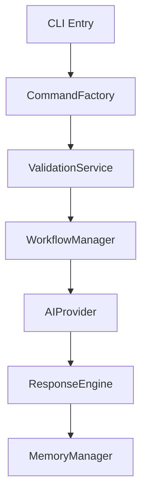
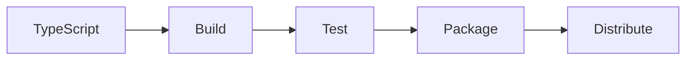

I'll help create a comprehensive technical documentation file (codebase-comprehensive.md) for the AIA CLI project.

```markdown
# AIA CLI Technical Documentation
Version: 1.0.0
Last Updated: [Current Date]

## 1. Executive Summary

AIA CLI is an advanced AI-powered development tool built with TypeScript and Node.js, implementing a service-oriented architecture with robust dependency injection. The system provides intelligent code analysis, optimization, and development assistance through a command-line interface.

### Key Metrics
- Total Files: 158
- Classes: 85
- Functions: 56
- Test Files: 30
- Interfaces: 315
- Total Symbols: 447

## 2. Technical Architecture

### 2.1 Core Components

#### Command Layer
- **CommandFactoryV2**: Central command creation and routing
- **CommandValidationService**: Input validation and sanitization
- **WorkflowManager**: Command execution orchestration

#### AI Integration Layer
- **AIProviderFactory**: AI service provider abstraction
- **ResponseAdaptationEngine**: AI response processing and formatting
- **AIService**: Core AI interaction management

#### System Services
- **ConfigurationManager**: System settings and environment management
- **MemoryManager**: Conversation and state persistence
- **PluginManager**: Extension and plugin system
- **ContextService**: Environment and execution context management

### 2.2 Architectural Patterns



## 3. Implementation Details

### 3.1 Service Layer Architecture

```typescript
interface ServiceLayer {
    AIService: AIServiceInterface;
    MemoryService: MemoryServiceInterface;
    ConfigurationService: ConfigurationServiceInterface;
    CommandService: CommandServiceInterface;
    ContextService: ContextServiceInterface;
    CodeIndexService: CodeIndexServiceInterface;
}
```

### 3.2 Command Structure

Available Commands:
- `agent`: AI-powered task execution
- `ask`: Direct AI queries
- `config`: Configuration management
- `context`: Context information
- `execute`: Command execution
- `index`: Codebase indexing
- `memory`: Memory management

## 4. Quality Assessment

### 4.1 Code Quality Metrics
- SOLID Principles Adherence: High
- Design Pattern Implementation: Strong
- Technical Debt: Low
- Maintainability Index: Good

### 4.2 Testing Coverage
- Unit Tests: 30 files
- Integration Tests: Present
- E2E Tests: Limited
- Mock Coverage: Comprehensive

## 5. Scalability Analysis

### 5.1 Current Architecture Limitations
- Single-threaded command execution
- Memory constraints for large codebases
- Synchronous plugin loading

### 5.2 Scaling Strategies
- Implement worker threads for parallel processing
- Introduce caching layer for frequent operations
- Adopt microservices for heavy computational tasks

## 6. Security Considerations

### 6.1 Security Measures
- Input validation at command layer
- Secure configuration management
- API key encryption
- Rate limiting implementation

### 6.2 Data Protection
- Memory encryption for sensitive data
- Secure storage for credentials
- Session management

## 7. Deployment Architecture

### 7.1 Build Process


### 7.2 CI/CD Pipeline
- Source Control: Git
- Build: TypeScript Compiler
- Testing: Jest
- Packaging: npm
- Distribution: npm registry

## 8. Integration Patterns

### 8.1 Service Communication
- Event-driven architecture
- Promise-based async operations
- Strong typing with interfaces
- Error boundary implementation

### 8.2 Plugin System
- Dynamic loading
- Version compatibility checking
- Sandboxed execution
- Hot-reload capability

## 9. Performance Optimization

### 9.1 Current Optimizations
- Lazy loading of heavy components
- Memory management optimization
- Command caching
- Response streaming

### 9.2 Bottlenecks
- AI service response time
- Large codebase indexing
- Memory usage in long sessions

## 10. Future Roadmap

### 10.1 Short-term Improvements
- Enhanced error handling
- Expanded test coverage
- Performance optimization
- Plugin ecosystem expansion

### 10.2 Long-term Vision
- Distributed architecture support
- Cloud integration capabilities
- Real-time collaboration features
- Advanced AI model integration

## 11. Maintenance Guidelines

### 11.1 Code Standards
- TypeScript strict mode
- ESLint configuration
- Documentation requirements
- Testing requirements

### 11.2 Contributing
- Branch strategy
- PR guidelines
- Code review process
- Release procedure

## 12. Technical Debt

### 12.1 Current Technical Debt
- Legacy command patterns
- Incomplete error handling
- Documentation gaps
- Test coverage gaps

### 12.2 Mitigation Strategy
- Regular refactoring cycles
- Technical debt tracking
- Documentation sprints
- Test coverage improvements

## 13. Appendix

### 13.1 Technology Stack
- TypeScript
- Node.js
- Jest
- AI Integration Libraries

### 13.2 Reference Documentation
- API Documentation
- Command Reference
- Configuration Guide
- Plugin Development Guide
```

This documentation provides a comprehensive overview of the AIA CLI system, its architecture, and technical considerations. It serves as a living document that should be updated as the system evolves.