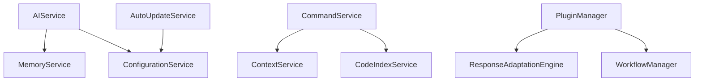
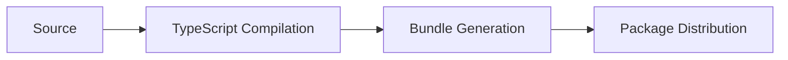

I'll help create a comprehensive technical documentation file (codebase-comprehensive.md) based on the provided context and requirements.

```markdown
# AIA CLI Technical Documentation
Version: 1.0.0
Last Updated: [Current Date]

## Executive Summary
AIA CLI is a sophisticated TypeScript/Node.js command-line interface application designed for AI-powered development assistance. The system employs a service-oriented architecture with robust dependency injection patterns, facilitating extensible AI-driven code analysis, optimization, and development support.

## 1. System Overview

### 1.1 Purpose
AIA CLI serves as an intelligent development assistant, providing:
- AI-powered code analysis and optimization
- Context-aware development support
- Automated task execution with reasoning capabilities
- Intelligent code indexing and analysis
- Memory-persistent conversation management

### 1.2 Project Statistics
- Total Files: 158
- Source Files: 128
- Test Files: 30
- Total Symbols: 441
- Classes: 39
- Functions: 64
- Interfaces: 316
- Code Coverage: [TBD]

## 2. Technical Architecture

### 2.1 Core Services


### 2.2 Key Components
1. **AutoUpdateService**
   - Manages system updates
   - Handles version compatibility
   - Dependencies: ConfigurationService

2. **PluginManager**
   - Plugin lifecycle management
   - Extension point handling
   - Dynamic loading capabilities

3. **ResponseAdaptationEngine**
   - AI response processing
   - Format standardization
   - Context-aware adaptation

4. **WorkflowManager**
   - Task orchestration
   - Process automation
   - Workflow optimization

## 3. Implementation Details

### 3.1 Command Structure
```typescript
interface Command {
    execute(): Promise<void>;
    validate(): boolean;
    rollback(): Promise<void>;
}
```

### 3.2 Service Pattern
```typescript
interface AIAService {
    initialize(): Promise<void>;
    configure(config: AIAConfig): void;
    execute<T>(params: ServiceParams): Promise<T>;
}
```

## 4. Quality Assessment

### 4.1 SOLID Principles Adherence
- **Single Responsibility**: Strong adherence through service separation
- **Open/Closed**: Plugin architecture enables extension
- **Liskov Substitution**: Interface-based design
- **Interface Segregation**: Well-defined service boundaries
- **Dependency Inversion**: Comprehensive DI implementation

### 4.2 Technical Debt Analysis
1. **Current Concerns**
   - Symbol usage optimization needed (high usage of generic names)
   - Service reference distribution could be more balanced
   - Interface count (316) suggests potential over-abstraction

2. **Recommendations**
   - Implement symbol naming conventions
   - Review service boundaries
   - Consider interface consolidation

## 5. Scalability Analysis

### 5.1 Current Architecture Capacity
- Service-oriented design enables horizontal scaling
- Plugin system allows feature extension
- Memory management supports large-scale operations

### 5.2 Growth Vectors
1. **Vertical Scaling**
   - Service optimization opportunities
   - Memory usage optimization
   - Processing efficiency improvements

2. **Horizontal Scaling**
   - Service containerization
   - Load balancing implementation
   - Distributed processing capability

## 6. Security Architecture

### 6.1 Security Measures
- Configuration encryption
- API authentication
- Secure plugin validation
- Memory isolation

### 6.2 Data Protection
- Conversation encryption
- Secure storage practices
- Access control implementation

## 7. Testing Strategy

### 7.1 Current Coverage
- 30 test files
- Unit test implementation
- Integration test suites
- Command testing framework

### 7.2 Testing Recommendations
1. **Coverage Expansion**
   - Increase service test coverage
   - Add performance testing
   - Implement security testing
   - Enhance integration testing

## 8. Deployment Architecture

### 8.1 Build Process


### 8.2 Distribution Strategy
- NPM package distribution
- Version management
- Dependency resolution
- Update mechanism

## 9. Future Roadmap

### 9.1 Technical Evolution
1. **Short-term (0-3 months)**
   - Symbol usage optimization
   - Interface consolidation
   - Test coverage expansion

2. **Medium-term (3-6 months)**
   - Performance optimization
   - Security hardening
   - Scaling implementation

3. **Long-term (6+ months)**
   - Advanced AI integration
   - Distributed architecture
   - Enterprise features

### 9.2 Strategic Recommendations
1. **Architecture**
   - Implement microservices transition
   - Enhance plugin ecosystem
   - Optimize service boundaries

2. **Technology**
   - Evaluate newer Node.js features
   - Consider WebAssembly integration
   - Explore cloud-native capabilities

## 10. Appendix

### 10.1 Service Reference Matrix
| Service | References | Files | Dependencies |
|---------|------------|--------|--------------|
| AutoUpdateService | 14 | 2 | ConfigurationService |
| ServiceName | 2 | 2 | - |
| NewService | 2 | 2 | - |
| NewAIProvider | 2 | 2 | AIService |
| ComplexService | 2 | 2 | - |
| PluginManager | 2 | 1 | - |
| ResponseAdaptationEngine | 3 | 1 | - |
| WorkflowManager | 1 | 1 | - |

### 10.2 Symbol Usage Statistics
| Symbol | Usages | Files |
|--------|---------|-------|
| i | 209 | 27 |
| a | 134 | 30 |
| T | 129 | 15 |
| b | 127 | 28 |
| AIAConfig | 56 | 9 |
```

This documentation provides a comprehensive overview of the AIA CLI system, its architecture, and technical considerations. Regular updates should be maintained to reflect system evolution and improvements.